# 设计模式学习

 * [设计模式学习](#设计模式学习)
      * [设计原则](#设计原则)
         * [1. 找出应用中可能需要变化之处，把它们独立出来，不要和那些不需要变化的代码混在一起](#1-找出应用中可能需要变化之处把它们独立出来不要和那些不需要变化的代码混在一起)
         * [2. 针对接口编程，而不是针对实现编程](#2-针对接口编程而不是针对实现编程)
         * [3. 多用组合，少用继承](#3-多用组合少用继承)
         * [4. 为了交互对象之间的松耦合设计而努力](#4-为了交互对象之间的松耦合设计而努力)
         * [5. 开闭原则](#5-开闭原则)
            * [实现建议](#实现建议)
         * [6. 依赖倒置原则 Dependency Inversion Principle](#6-依赖倒置原则-dependency-inversion-principle)
            * [相关模式](#相关模式)
            * [指导方针](#指导方针)
      * [设计模式](#设计模式)
         * [1. 策略模式 Strategy Pattern](#1-策略模式-strategy-pattern)
         * [2. 观察者模式 Observe Pattern](#2-观察者模式-observe-pattern)
            * [更新策略](#更新策略)
            * [Java 内置的观察者模式](#java-内置的观察者模式)
            * [观察者模式、发布/订阅模式的区别](#观察者模式发布订阅模式的区别)
         * [3. 装饰者模式 Decorator](#3-装饰者模式-decorator)
            * [缺点](#缺点)
         * [4. 工厂方法模式 Factory](#4-工厂方法模式-factory)
            * [简单工厂和工厂方法的差异](#简单工厂和工厂方法的差异)
            * [工厂模式的优点](#工厂模式的优点)
            * [看看对象依赖](#看看对象依赖)
            * [抽象工厂模式](#抽象工厂模式)
            * [工厂方法和抽象工厂](#工厂方法和抽象工厂)
            * [我的理解](#我的理解)
               * [简单工厂：只有一家店，想做什么披萨就做什么披萨](#简单工厂只有一家店想做什么披萨就做什么披萨)
               * [工厂模式：管理至少 2 种以上具有当地特色的披萨店](#工厂模式管理至少-2-种以上具有当地特色的披萨店)
               * [抽象工厂：所有的原料必须来自指定的工厂，按照设计图制作披萨](#抽象工厂所有的原料必须来自指定的工厂按照设计图制作披萨)
      * [参考资料](#参考资料)

## 设计原则

### 1. 找出应用中可能需要变化之处，把它们独立出来，不要和那些不需要变化的代码混在一起

> 把会变化的部分取出并"封装"起来，好让其他部分不受到影响。
> 换句话说，如果每次新的需求一来，都会使某方面的代码发生变化，那么你就可以确定，这部分的代码需要被抽出来，和其他稳定的代码有所区分。

### 2. 针对接口编程，而不是针对实现编程
> “针对接口编程”真正的意思是“针对超类型（supertype）编程”。
> “针对接口编程”关键就在多态”。
> 利用多态，程序可以针对超类型编程，执行时会根据实际状况执行到真正的行为，不会被绑死在超类型的行为上。

### 3. 多用组合，少用继承

### 4. 为了交互对象之间的松耦合设计而努力
- 松耦合的设计之所以能让我们建立有弹性的OO系统，能够应对变化，是因为对象之间的相互依赖降到了最低。

### 5. 开闭原则
> 类应该对扩展开放，对修改关闭

- 目标是允许类容易扩展，在不修改现有代码的情况下，就可搭配新的行为。
- 这样的设计具有弹性可以应对改变，可以接受新的功能来应对改变的需求。

#### 实现建议
- 观察者模式：通过加入新的观察者，我们可以在任何时候扩展Subject，而且不需要向Subject中添加代码。
- 装饰模式（完全遵循开闭原则）。
- 遵循开闭原则，通常会引入新的抽象层次，增加代码的复杂度。
- 需要把注意力集中在设计中最有可能改变的地方，然后应用开闭原则。
- 每个地方都采用开闭原则，是一种浪费，也没必要，还会导致代码变得复杂且难以理解。

### 6. 依赖倒置原则 Dependency Inversion Principle
> 要依赖抽象，不要依赖具体类

- 不能让高层组件依赖底层组件。

#### 相关模式
- 工厂方法是最具有威力的技巧之一。

#### 指导方针
- **变量不可以持有具体类的引用**：如果使用 new，就会持有具体类的引用。可以改用工厂来避开这样的做法。
- **不要让类派生自具体类**：如果派生自具体类，你就会依赖具体类。请派生自一个抽象（接口或抽象类）。
- **不要覆盖基类中已实现的方法**：如果覆盖基类已实现的方法，那么你的基类就不是一个真正适合被继承的抽象。基类中已实现的方法，应该由所有的子类共享。

- - -

- 不大会改变的类，在代码中直接实例化具体类也无大碍：例如”字符串“对象。
- 如果有个类可能改变，可以采用一些技巧（例如工厂方法）来封装改变。

## 设计模式

### 1. 策略模式 Strategy Pattern
> 策略模式定义了算法簇，分别封装起来，让他们之间可以相互替换，此模式让算法的变化独立于使用算法的客户。

### 2. 观察者模式 Observe Pattern
> 观察者模式定义了对象之间的一对多依赖，这样一来，当一个对象改变状态时，它的所有依赖者都会收到通知并自动更新。

- 观察者模式提供了一种对象设计，让主题和观察者之间松耦合。

#### 更新策略
- 推
- 拉

#### Java 内置的观察者模式
- extends java.util.Observable

#### 观察者模式、发布/订阅模式的区别
- 在**观察者模式**中，观察者知道主题，主题也维护观察者的记录。而在**发布者/订阅者**中，发布者和订阅者不需要彼此了解。他们只是在消息队列或代理的帮助下进行通信。
- 在**发布者/订阅者模式**中，与观**察者模式**相反，组件是松散耦合的。
- **观察者模式**大多数是以同步方式实现的，即，当某个事件发生时，主题调用其所有观察者的适当方法。**发布者/订阅者模式**大多使用异步方式（使用消息队列）。
- **观察者模式**需要在单个应用程序地址空间中实现。**发布者/订阅者模式**更多地是跨应用程序模式。

- [原文： Observer vs Pub-Sub pattern](https://hackernoon.com/observer-vs-pub-sub-pattern-50d3b27f838c)

### 3. 装饰者模式 Decorator
> 动态的将责任附加到对象上。若要扩展功能，装饰者提供了比继承更有弹性的代替方案

- 利用继承设计子类的行为，是在编译时静态决定的，而且所有的子类都会继承到相同的行为。
- 利用组合的方法扩展对象的行为，可以在运行时动态的进行扩展。
- 通过动态组合对象，可以写新的代码添加新功能，而无需修改现有代码。减少Bug。

*** 

- 装饰者和被装饰对象有相同的超类型。
- 可以用一个或多个装饰者包装一个对象。
- **装饰者可以在所委托被装饰者的行为之前或之后，加上自己的行为，以达到特定的目的。**
- 对象可以在任何时候被装饰，所以可以在运行时动态的、不限量的用你喜欢的装饰者来装饰对象。

***

- 继承是为了达到”类型匹配“，而不是利用继承获得行为。
- 将装饰者与组件组合时，就是在加入新的行为。所得到的新行为，并不是继承自超类，而是由组合对象得来的。
- 行为来自装饰者和基础组件，或与其他装饰者之间的组合关系。

***

- 装饰者该做的事，就是增加行为到被包装对象上。当需要窥视装饰者链中的每一个装饰者时，这就超出他们的天赋了。

#### 缺点
- 利用装饰者模式，常常造成设计中有大量的小类，数量实在太多，可能会造成使用此API程序员的困扰。过度使用，会让程序变得很复杂。
- 采用装饰者在实例化组件时，将增加代码的复杂度。因为不只需要实例化组件，还要把此组件包装进装饰者中，天晓得有几个！

### 4. 工厂方法模式 Factory
> **工厂方法模式**定义了一个创建对象的接口，但是由子类决定要实例化的类是哪一个。工厂方法让类把实例化推迟到子类。
> **抽象工厂模式**提供一个接口，用于创建相关或依赖对象的家族，而不需要明确指定具体类。

- 工厂方法允许类将实例化延迟到子类进行。

#### 简单工厂和工厂方法的差异
- 简单工厂把所有事情，在一个地方处理完了，然后工厂方法却是创建一个框架，让子类决定如何实现。
- 简单工厂可以把对象的创建封装起来，但是简单工厂不具备工厂模式的弹性，因为简单工厂不能变更正在创建的产品。

#### 工厂模式的优点
- 将创建对象的代码集中在一个对象或方法中，可以避免代码重复，方便以后维护。
- 客户在实例化对象时，只依赖于接口，而不是具体类。
- 可以帮助我们针对接口编程，而不是针对实现编程。
- 让代码更具弹性，可以应对未来的扩展。

#### 看看对象依赖
- 当你直接实例化一个对象时，就是在依赖它的具体类。

#### 抽象工厂模式
- 抽象工厂允许客户使用抽象的接口来创建一组相关的产品，而不需要知道（或关心）实际产出的具体产品是什么。
- 客户从具体的产品中被解耦。

- - - 

- 抽象工厂的任务是定义一个负责创建一组产品的接口。
- 这个接口内的每个方法都负责创建一个具体产品。

#### 工厂方法和抽象工厂
- 都是负责创建对象。
  - 工厂方法：使用继承。
  - 抽象工厂：通过对象的组合。
- 将客户从具体类型中解耦。
- 抽象工厂可以把一群相关的产品集合起来。
- 抽象工厂经常使用工厂方法来实现具体工厂。
- 使用场景
  - 抽象工厂：当需要创建产品家族和想让制造的相关产品集合起来时可以使用。
  - 工厂方法：把客户代码从需要实例化的具体类中解耦。或者如果你目前还不知道将来需要实例化哪些具体类时，也可以用。

#### 我的理解
- 以披萨店举例

##### 简单工厂：只有一家店，想做什么披萨就做什么披萨
  具体实现
  - 芝士披萨（面粉、芝士、白菜）
  - 香肠披萨（面粉、腊肠、黄瓜）
  - 海鲜披萨（面粉、芝士、榴莲）
  - 素食披萨（面粉、芝士、榴莲）
  
##### 工厂模式：管理至少 2 种以上具有当地特色的披萨店

具体实现
  
| 中式披萨 | 美式披萨 |
| --- | --- |
| CN芝士披萨 【**面**：东北面粉；**酱**：东北大酱；**浇头**：上海芝士】 | USA芝士披萨 【**面**：芝加哥面粉；**酱**：沙拉酱；浇**头**：纽约芝士】|
| CN香肠披萨 【**面**：浙江糯米粉；**酱**：东北大酱；**浇头**：东北红肠】 | USA香肠披萨 【**面**：加州面粉；**酱**：番茄酱；浇**头**：意式香肠】|
| CN海鲜披萨 【**面**：宁夏面粉；**酱**：郫县豆瓣；**浇头**：秋刀鱼】| USA海鲜披萨 【**面**：德洲面粉；**酱**：蒜蓉酱；**浇头**：帝王蟹】|
| CN素食披萨 【**面**：四川米粉；**酱**：韭花、蒜泥；**浇头**：榴莲、臭豆腐】| USA素食披萨 【**面**：德克萨斯洲面粉；**酱**：蒜蓉酱、番茄酱；**浇头**：榴莲、洋白菜】|

##### 抽象工厂：所有的原料必须来自指定的工厂，按照设计图制作披萨
- 只要有图纸、原料就能生产披萨，灵活的不要不要的。
- 图纸是抽象出来的接口，一般不会变。
- 具体原料的数量可以任意修改。
- 不同原料的组合 = 新产品！

原料工厂（都是有品牌的）

| 中国地区 | 美国地区 |
| --- | --- |
| **面**：沈阳香雪面粉、北大荒面粉、潍坊风筝面粉 | **面**：Bob高筋粉、YiNoy面粉 |
| **酱**：海天黄豆酱、六必居韭花、王致和臭豆腐 | **酱**：Heng 番茄酱、Kafu沙拉酱 |
| **浇头**：秋林红肠、蜀记腊肉、东海秋刀鱼、乡巴佬小番茄 | **浇头**：Ragu 香肠、Kasa牛油果酱、Galebi大闸蟹、Kukii菠萝 |

披萨图纸
制作披萨的奥义：面粉 + 酱 + 浇头
  
不同的工厂定义不同的原料组合，按图纸就可轻松生产不同的披萨

具体实现

| 中国的工厂 | 美国的工厂 |
| --- | --- |
| 芝士披萨【**面**：沈阳香雪面粉；**酱**：海天黄豆酱；**浇头**：蜀记腊肉】 | 芝士披萨【**面**：Bob高筋粉；**酱**：Heng 番茄酱；**浇头**：Kasa牛油果酱】 |
| 香肠披萨【**面**：北大荒面粉；**酱**：六必居韭花；**浇头**：秋林红肠】 | 香肠披萨【**面**：YiNoy面粉；**酱**：Kafu沙拉酱；**浇头**：Ragu 香肠】 |
| 海鲜披萨【**面**：潍坊风筝面粉；**酱**：海天黄豆酱；**浇头**：东海秋刀鱼】 | 海鲜披萨【**面**：YiNoy面粉；**酱**：Kafu沙拉酱；**浇头**：Galebi大闸蟹 |
| 素食披萨【**面**：沈阳香雪面粉；**酱**：王致和臭豆腐；**浇头**：乡巴佬小番茄】 | 素食披萨【**面**：Bob高筋粉；**酱**：Heng 番茄酱；**浇头**：Kukii菠萝】 |

## 参考资料
- 《Head First 设计模式》作者：弗里曼 Mary Eleanor Wilkins Freeman ISBN: 9787508353937
- [《Head First 设计模式》源码](https://www.wickedlysmart.com/head-first-design-patterns/)
- [《Head First 设计模式》源码 Maven 版](https://github.com/wyyl1/Head-First-Design-Patterns-Source)
- [GitHub 在线生成目录](https://sleepeatcode.com/ghtoc) | [来源](https://github.com/ekalinin/github-markdown-toc)

